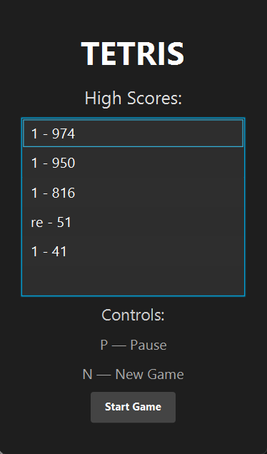
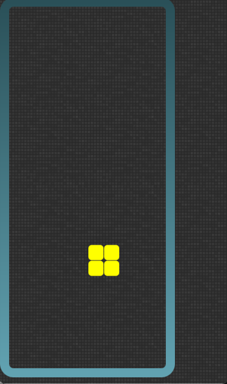
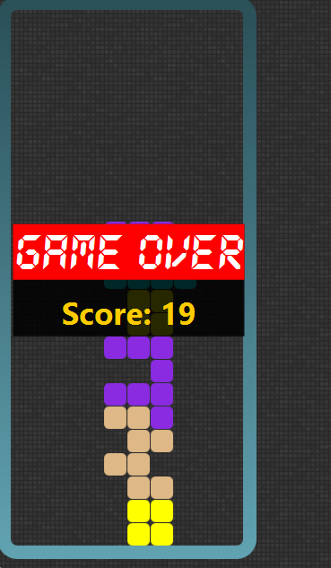
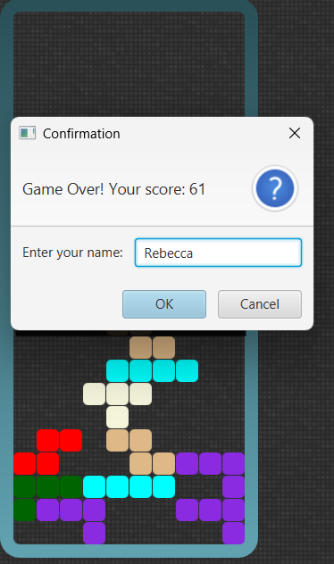
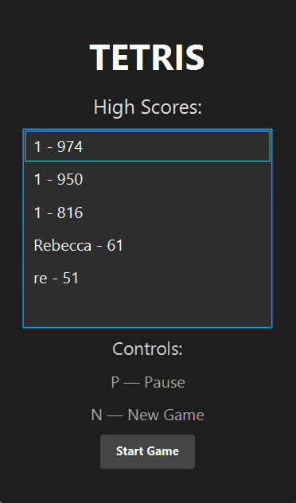

# Tetris JavaFX - Coursework Submission

**Student Name:** Rebecca Anita Pereira  
**Student ID:** 20619091  
**GitHub Repository:** https://github.com/Xillemica/DMSCW2025  
**IDE:** Visual Studio Code  
**Java Version:** 23.0.1  

A JavaFX-based Tetris game implementing classic Tetris mechanics with scores, high scores, and a simple GUI.

## Compilation Instructions
1. Clone the repository: `git clone https://github.com/Xillemica/DMSCW2025`
2. Open in your IDE (IntelliJ IDEA, Eclipse, or VS Code with Java extensions)
3. Ensure JavaFX SDK is added to your project module path
4. Run using Maven: `mvn clean javafx:run`

## Features Implemented and Working Properly
- High score persistence to file (scores.txt)
- Game Over screen with player name input
- Start screen with high score display
- Pause/Resume functionality (P key)
- New game restart (N key)
- Scoreboard display (H key)
- High score

## Features Implemented but Not Working Properly
None - All implemented features are fully functional.

## Features Not Implemented
Ghost pieces

Grid

Highlight

Hold piece

Preview piece

## Controls
| Key        | Action           |
|:----------:|:----------------:|
| Left / A   | Move brick left  |
| Right / D  | Move brick right |
| Up / W     | Rotate brick     |
| Down / S   | Soft drop        |
| Space      | Hard drop        |
| P          | Pause / Resume   |
| N          | Start new game   |
| H          | Show scoreboard  |

## How to Play
1. Launch the game
2. Use the controls to move, rotate, and drop bricks.
3. Clear lines to increase your score.
4. When the game ends, enter your name to save your high score.
5. Restart with the N key or close the game.

## New Java Classes
| Class | Location | Purpose |
|-------|----------|---------|
| `StartScreen` | `com.comp2042` | Initial game menu with high scores |
| `HighScore` | `com.comp2042` | Represents a player's score entry |
| `Scoreboard` | `com.comp2042` | Manages loading/saving high scores |

## Modified Java Classes
- GameController
- GuiController
- Main
- SimpleBoard
- GameOverPanel
- MatrixOperations
- NotificationPanel

## Refactoring Activities and Improvements

### 1. GameController.java (65 lines)
| Problem | Solution | Impact |
|---------|----------|--------|
| Constructor doing too many things | Moved initialization to initGame() method | Better separation of concerns |
| onDownEvent() too complex | Extracted logic into helper methods (handleBrickLanding(), updateAndGetView()) | Improved readability and testability |
| Repeated getViewData() calls | Introduced helper method to reduce duplication | Better performance and maintainability |
| Magic numbers in board initialization | Converted to constants BOARD_HEIGHT and BOARD_WIDTH | Easier configuration and understanding |
| Board field safety | Made board field final as it's never reassigned | Thread safety and clear intent |

### 2. GuiController.java (225 lines)
| Problem | Solution | Impact |
|---------|----------|--------|
| Long initialize() method | Split into setupFont(), setupGameOverPanel(), setupReflectionEffect(), setupKeyEvents() | Single Responsibility Principle |
| Repeated layout calculations | Created helper method positionBrickPanel() | DRY principle, reduces duplication |
| Magic numbers throughout | Replaced with constants (BRICK_SIZE, FONT_SIZE, BRICK_ARC, etc.) | Easier maintenance and understanding |
| Large switch in getFillColor() | Replaced with array lookup COLORS[] | Cleaner, more performant code |
| Inline event handlers | Moved to separate handleKeyPress() method | Better organization and testability |
| Complex moveDown() method | Simplified by extracting logic | Improved readability |
| Verbose boolean checks | Changed isPause.getValue() == Boolean.FALSE to !isPause.get() | Cleaner, more idiomatic Java |
| Unused imports/methods | Removed unused imports and bindscore() method | Cleaner codebase |

### 3. Main.java (35 lines)
| Problem | Solution | Impact |
|---------|----------|--------|
| start() method messy | Extracted startup logic | Cleaner method with single responsibility |
| Unused ResourceBundle | Removed unused parameter and import | Reduced complexity |
| Magic numbers | Defined as constants | Better configuration management |
| Poor variable naming | Renamed c to guiController | Improved code clarity |

### 4. MatrixOperations.java (100 lines)
| Problem | Solution | Impact |
|---------|----------|--------|
| intersect() logic hard to read | Fixed variable names, fixed coordinate bug, simplified condition | Correct collision detection and better readability |
| checkOutOfBound() confusing | Rewrote as isOutOfBounds() with direct boolean logic | Clearer intent and correct behavior |
| copy() overly complex | Simplified to clean deep copy loop | Better performance and readability |
| merge() indexing mistakes | Corrected indexing and improved readability | Fixed bug where bricks merged incorrectly |
| checkRemoving() too complex | Extracted logic, renamed variables, clearer flow | Better understanding of row-clearing algorithm |
| deepCopyList() unnecessarily complex | Replaced stream with simple for-loop | Better performance and readability |
| Utility class instantiation risk | Added private constructor with comment | Prevents accidental instantiation |

### 5. NotificationPanel.java (46 lines)
| Problem | Solution | Impact |
|---------|----------|--------|
| Method name too specific | Renamed showScore() to show() | Better reflects general-purpose animation |
| Poor variable naming | Improved descriptive names | Self-documenting code |
| Animation logic cluttered | Extracted createFadeTransition() and createTranslateTransition() | Single Responsibility Principle |
| Magic numbers | Replaced with constants (FADE_DURATION_MS, etc.) | Easier adjustment and understanding |
| Verbose anonymous inner class | Replaced with lambda expression | Cleaner, more modern Java |

### 6. SimpleBoard.java (127 lines)
| Problem | Solution | Impact |
|---------|----------|--------|
| Movement logic duplicated | Consolidated into single moveBrick(dx, dy) method | DRY principle, less code duplication |
| Magic spawn coordinates | Added SPAWN_POINT constant | Easier to adjust spawn location |
| Inconsistent naming/style | Cleaned variable names and improved consistency | Better readability and maintainability |

## Key Refactoring Principles Applied
Single Responsibility Principle: Each class/method now has one clear purpose
DRY (Don't Repeat Yourself): Eliminated code duplication
Encapsulation: Made fields private with getters where appropriate
Immutability: Used final for fields that shouldn't change
Defensive Programming: Added array copying to prevent external mutation
Self-Documenting Code: Improved naming and extracted methods
Constant Management: Replaced magic numbers with named constants

## Unit Testing (JUnit)
Note: Due to the graphical nature of JavaFX and tight deadline, comprehensive JUnit tests were not implemented. However, the following testing strategies were employed:
Manual testing of all game features

## Demonstration Video Highlights
In the accompanying Demo.mp4 video, I demonstrate:
Two Proudest Achievements:
Complete high score system with file persistence
Consistent UI
Showcase of the gameplay
Overview of class diagram
Additions and refactors

## Preview of the Game (Screenshots)
<table>
<tr>
  <td> Main menu</td>
  <td> Gameplay</td>
  <td> Game Over</td>
  <td> Save Score</td>
  <td> New Score</td>
</tr>
</table>

## Credits and References
Original codebase: https://github.com/kooitt/CW2025

JavaFX Documentation: https://openjfx.io/

Coursework Specification: COMP2042 Software Maintenance

This project was submitted as partial fulfillment of the COMP2042 Software Maintenance module at the University of Nottingham.
